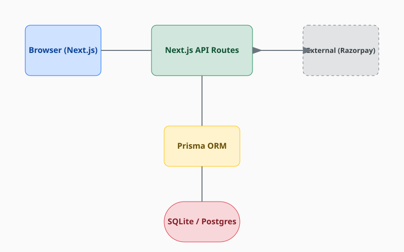

# System Architecture - BharatClean

## 1. Technology Stack
- **Frontend**: Next.js 16 (App Router, Turbopack)
- **Styling**: Tailwind CSS, Shadcn UI
- **Backend**: Next.js API Routes & Server Actions
- **Database**: SQLite (Local) / PostgreSQL (Production)
- **ORM**: Prisma
- **Auth**: NextAuth.js v5 (JWT Strategy)
- **Payments**: Razorpay SDK
- **Infrastructure**: Docker, GitHub Actions, Netlify

## 2. Infrastructure Diagram (Logical)

## 3. Automation & Testing Stack
- **Language**: Java 8 / TypeScript
- **E2E Engine**: Selenium 3.141.59
- **Orchestration**: TestNG 7.4.0
- **Unit Testing**: Vitest
- **Performance**: k6 (Load Testing)
- **Reporting**: Allure 2.17.3

## 4. Key Modules
### Admin Dashboard
Centralized management for users, bookings, and support tickets. Utilizes Prisma for complex relational queries across the platform.

### Cleaner Portal
Dedicated interface for cleaning professionals to manage their schedules, view customer addresses, and mark jobs as completed in real-time.

### Subscription Engine
Handles recurring billing and plan management via Razorpay integration, ensuring seamless service access for customers.

## 5. Key Design Patterns
- **Singleton**: Used in `DriverManager` for thread-safe WebDriver sessions.
- **Page Object Model (POM)**: Decouples test logic from UI structure.
- **Layered Architecture**: Separation between UI, API logic (Server Actions), and Database access.
- **Role-Based Access Control (RBAC)**: Strict permissioning enforced via NextAuth.js callbacks and middleware.
