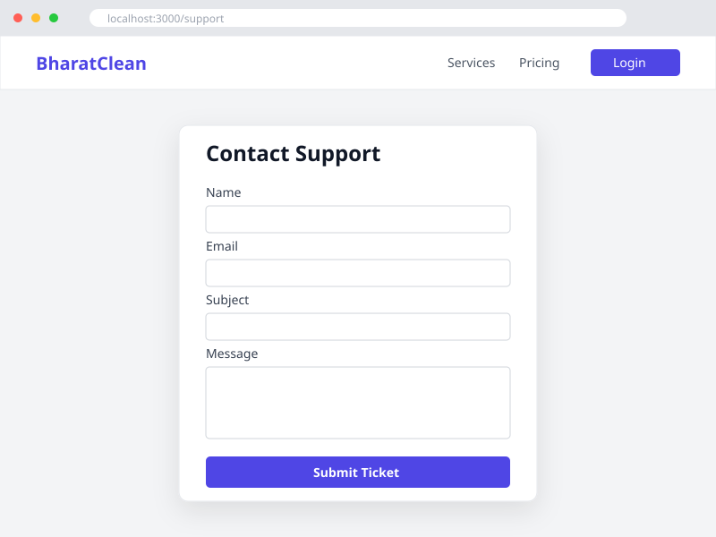

# Functional Requirements Document (FRD): Support Ticket System

## 1. Introduction
The purpose of this feature is to allow users (both registered and guests) to submit support tickets, feedback, or general inquiries to the BharatClean administrative team.

## 2. Features and Requirements

### 2.1 Database Schema
*   **Model**: `SupportTicket`
*   **Fields**:
    *   `id` (String, Primary Key, CUID)
    *   `name` (String, required)
    *   `email` (String, required)
    *   `subject` (String, required)
    *   `message` (String, required)
    *   `status` (String, default: "OPEN")
    *   `createdAt` (DateTime, default: now())

### 2.2 API Endpoint
*   **Route**: `POST /api/support`
*   **Payload**: `{ "name": "...", "email": "...", "subject": "...", "message": "..." }`
*   **Response**: `200 OK` with JSON `{ "success": true }` on success, `400 Bad Request` if validation fails.

### 2.3 User Interface
*   **Route**: `/support`
*   **Components**: A form containing fields for Name, Email, Subject, Message, and a Submit button.
*   **Wireframe**:
    
*   **Behavior**: Upon successful submission, a success message "Support ticket submitted successfully!" should be displayed, and the form should be cleared.

### 2.4 Automated Testing
*   **UI Test (Selenium + TestNG)**: Verify that the `/support` page loads, the form accepts input, and submission yields a success message.
*   **BDD (Cucumber)**: Ensure scenarios accurately describe the user journey for submitting a support ticket.
